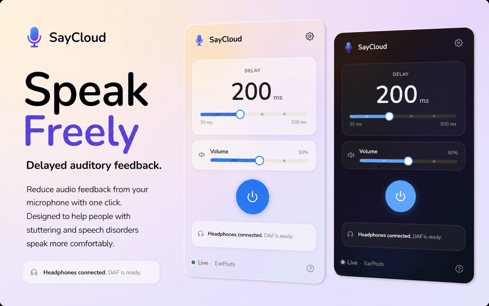

  

# SayCloud

Real-time Delayed Auditory Feedback (DAF) for browser calls.

SayCloud is a Chrome extension that plays your own voice back through headphones with a small adjustable delay. I built it because I wanted a simple DAF tool that works directly in the browser, especially for Google Meet and other browser-based calls.

## Links

- Chrome Web Store: [SayCloud](https://chromewebstore.google.com/detail/saycloud/micpgdjbcbphgpacgfofadckcgmjjohc)
- Website: https://saycloud.app
- Feedback: feedback@saycloud.app

## Features

- Adjustable delay
- Microphone selection
- Volume control
- Local audio processing only
- No recordings
- No accounts
- Works in the browser

## Privacy

SayCloud processes audio locally in your browser. Your audio is not recorded, stored, or sent to a server.

## Status

This repository is for project information, public links, and feedback. The source code is not open source at this time.

Copyright © 2026 SayCloud. All rights reserved.